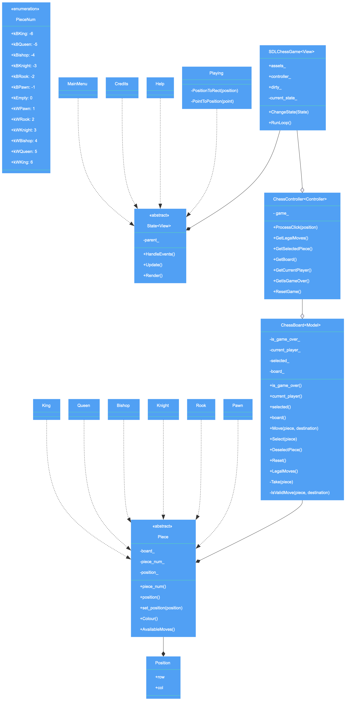
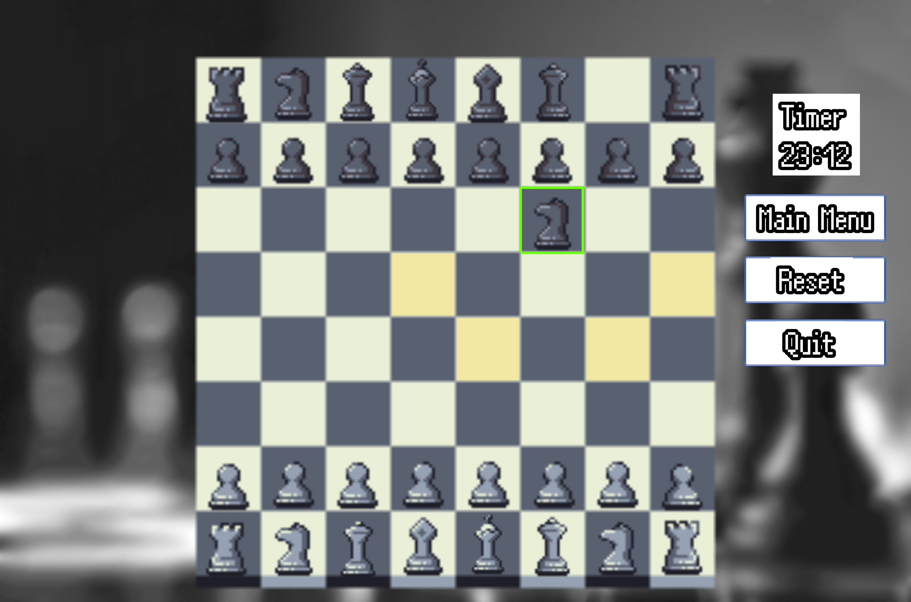
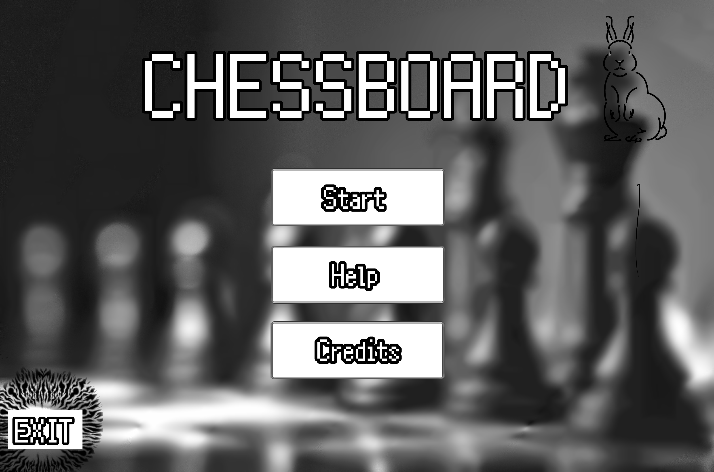
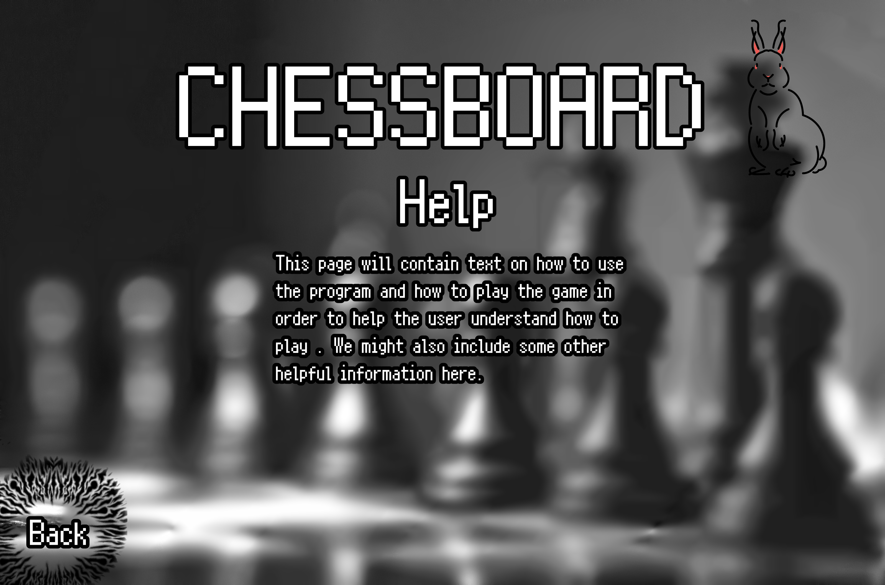
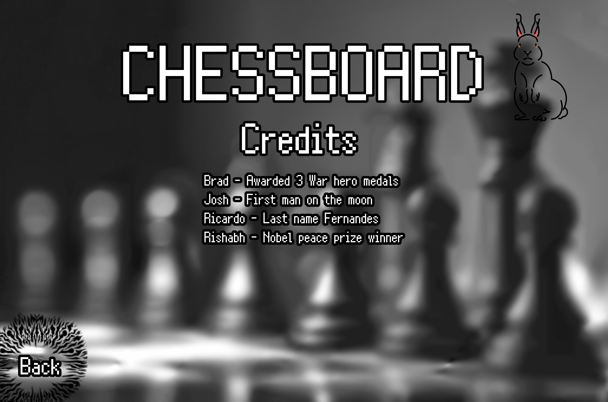

## Software Design Document
---
# Chessboard

## Contributors:
**Team Prometheus**

- Brad 
- Josh
- Ricardo
- Rishabh

## Contents
1. [Introduction](#intro)
2. [Design Overview](#overview)
3. [SDLChessGame](#sdl-chess-game)
4. [State](#state)
5. [Playing](#playing)
5. [Main Menu](#main-menu)
7. [Help](#help)
8. [Credits](#credits)
9. [ChessController](#controller)
10. [Chessboard](#chessboard)
11. [Piece](#piece)
12. [Globals](#globals)
13. [File Structure](#file-structure)

## 1. Introduction <a name="intro" />
### 1.1 Purpose
The purpose of this document is to provide a detailed description of the implementation of the chess software built by the team Prometheus. Software is a c++ based chess game.
### 1.2 Scope
The document describes the implementation details of the chess program. The program consists of 3 major constituents, namely Model, Controller, View (Names are subject to change). The document will not be concerned with any testing of the program.
## 2. Design Overview <a name="overview" />

### 2.1 Description of the Program
Chessboard is a two-player pass-and-play chess game. The game will take place on a traditional 64-tile chessboard in a graphical environment. Upon launching Chessboard, the user can start a game via the main menu. On their turn, a player can select one of their chess pieces and move it to any legal tile. When a player selects a piece, the piece will follow the mouse until the player selects a valid tile to place it, after which the next player will take their turn using the same keyboard and mouse. The game will follow all rules outlined in http://www.fraserheightschess.com/Documents/BasicChessRules.pdf.
### 2.2 Technologies Used
The chess program is entirely based on C++. The program uses SDL libraries for the graphical components. OpenGL libraries maybe used.

The target platforms are Microsoft Windows, Linux and MacOS.


## 3. SDLChessGame <a name="sdl-chess-game" />
```
assets_
controller_
dirty_
currrent_state_
ChangeState(state)
RunLoop()
```
The central component of the user interface, `SDLChessGame` manages the UI's current state. It is in charge of switching between menus and running the game loop. It also acts as a container for all of the game's assets.`SDLChessGame` is also in charge of passing information to the `ChessController` when necessary so it can update the games internal representation.

### 3.1 Attributes
Currently, some of `SDLChessGame`'s data members are public despite this breaking the standards outlined in Google's C++ style guide. `SDLChessGame`'s `current_state_` needs to be able to access all three of the public data members.
#### Public

- **assets_ :** Dictionary
    - Contains all images used in the game. The images associated with a specific `Piece` can be accessed using its related `PieceNum` as a key.
<br>

- **controller_ :** ChessController
    - The controller acts as a proxy between the games model (`ChessBoard`), and `SDLChessGame`, providing it with method for seeing and interacting with the games internal state, without being able to directly modify it.
<br>

- **dirty_ :** boolean
    - a flag denoting whether or not an event has occured that requires the screen to be redrawn. This prevents the program from having to redraw the entire screen on each iteration of the game loop.
<br>

#### Private

- **current_state_ :** State
    - the screen the player is currently interacting with. This property provides `SDLChessGame` with methods for processing events and displaying the current screen to the user.
<br>

### 3.2 Methods
#### Public

- **ChangeState(state:** State **)**
    - This is used to transition the program from one screen to another. It deletes the current state and replaces it with the provided one. `SDLChessGame` will use this newly created states methods inside of `run_loop`.
<br>

- **RunLoop()**
    ```
    while the programming is running:
        process events
        update the games internal representation
        render the represention to the screen
    ```
    - continuously processes events from the user, updates the progams internal state then renders the screen using the methods provided by the user interface's current state.
<br>

## 4. State <a name="state" />
```
parent_

HandleEvents()
Update()
Render()
```
The State machine is an abstract class that handles every event that takes place on the chessboard, then `updates` the board and `renders` the new and updated version of the board. The state provides `SDLChessGame` with a uniform interface for interacting with the various states of the game using the virtual methods within state.
### 4.1 Attributes
#### Private

- **parent_ :** SDLChessGame
    - The parent class that handles the view of the different playing states.
<br>

### 4.2 Methods
#### Public

- **HandleEvents() :** void
    - Handles any event that could take place in either of the states and has a void return type.
<br>

- **Update() :** void
    - Updates the state with the neccessary changes based on what events took place in the current state. Has a void return type.
<br>

- **Render() :** void
    - Renders the updated version of the board for the view to display to the user after each event is handled successfully. Has a void return type.    
<br>

## 5. Playing <a name="playing" />
```
PositionToRect(position)
PointToPosition(point)
```
Playing is the in-game state. One of its main functions is to process the users mouse click events. If a board tile is clicked `Playing` will try to determine which one, passing this information to the `ChessController` which will use it to update the `Chessboard` if necessary. This state will also check if any of the on-screen buttons have been clicked, in which case it will change `SDLChessGame`'s state appropiately.
<div style="text-align: center">                                                
                   
</div>                   

### 5.1 Methods
#### Private

- **PositionToRect(position:** Position **) :** SDL_Rect
    - Takes a `Position` on the game board, and converts it into a rectangular area on the screen. This is used to draw game piece assets in the correct area of the screen.
<br>

- **PointToPosition(point:** SDL_Point **) :** Position
    - Takes the cooridinates of the mouse on screen when the user clicked the left-mouse button and attempts to convert it into a `Position` on the game boards grid. 
<br>

## 6. Main Menu <a name="main-menu" />
<div style="text-align: center">                                                
                   
</div>                   
The Main Menu is the Startup screen of the application. From here, users can navigate to all sections of the application. The Main Menu gives the user the following options:

- Start – Start a pass-and-play game of chess with another player.
- Help – Read the instruction for the app.
- Credits – Credits screen credits all the developers with a short description of their role. Exit – Stops the program.

The Main Menu is also accessible after a game ends and from the in-game state if any player chooses to do so.

## 7. Help <a name="help" />
<div style="text-align: center">                                                
                   
</div>                   
The Help screen is accessible from the main menu. This page contains basic instructions on how to use the app. Instructions like what type of input the app expects, what’s considered a bad input, and what other bounds there are on the user.
It also presents a brief overview of some basic chess rules and piece movements, acting as an introduction for new players to chess.

## 8. Credits <a name="credits" />
<div style="text-align: center">                                                
                   
</div>                   
The “credits” page’s objective is to recognize the individuals involved in producing the product. The page’s style is straightforward: identify everyone engaged in the program’s creation and provide a summary of their role or contribution.
Any outside help and references are also listed here.


## 9. ChessController <a name="controller" />
```
game_
ProcessClick(position)
GetLegalMoves()
GetSelectedPiece()
GetBoard()
GetCurrentPlayer()
GetIsGameOver()
ResetGame()
```
Exposing only necessary aspects of `game`, The chess controller acts as an intermediary between the user interface and the game's internal representation and logic. It provides `SDLChessGame` with enough information about the state of `game`to represent it on the screen. The only input `SDLChessGame` needs to provide the chess controller is the `Position` on the `game` board a player has clicked. Using the internal state of the `game`, `ChessController` can then assume the users intent.
### 9.1 Attributes
#### Private

- **game_ :** Chessboard
    - The internal representation of the gameboard.
<br>

### 9.2 Methods
#### Public

- **ProcessClick(position:** Position **)**
    ```
    if a piece is currently selected:
        move it to the clicked position
    else if the clicked position is the tile of the selected piece:
        deselect the currently selected piece
    otherwise, if the clicked tile contains a piece:
        select the clicked piece
    ```
    - If the player doesn't currently have a piece selected, select the piece in the provided `position` if one exists, otherwise, attempt to move the currently selected piece to the clicked `position`.
<br>

- **GetLegalMoves( ) :** Array\<Position\>
    - get all available moves for the currently selected piece. If a piece is selected, call its `LegalMoves()` method and return the resulting array. If no piece is selected, return an empty array.
<br>

- **GetSelectedPiece( ) :** PieceNum
    - return the `PieceNum` associated with `game_`'s currently selected `Piece`. If no piece is selected, return `Null`.
<br>

- **GetBoard( ) :** Array\<Array\<PieceNum\>\>
    - return the current layout of pieces on the gameboard. `PieceNum` is used to limit direct access to the games'`Piece` objects. See `Board()` under section 10.2.1 for an example of the array returned when the board is in its default state.
<br>

- **GetCurrentPlayer( ) :** boolean
    - return `game_`'s current player
<br>

- **GetIsGameOver( ) :** boolean
    - get the game over status from `game_` and return it
<br>

 - **ResetGame( )**
    - return the gameboard to its initial state, putting all the pieces back to their default tiles by utilizing `game_`'s `Reset()` method.
<br>

## 10. Chessboard (Model)  <a name="chessboard" />
```
is_game_over_
current_player_
selected_
board_
is_game_over()
current_player()
selected()
board()
Move(piece, destination)
Select(piece)
DeselectPiece()
Reset()
LegalMoves(piece)
Take(piece)
IsValidMove(piece, destination)
```
Chessboard directly manages the internal representation of the game board's state, and contains all its related logic. It is completely independent from the user interface and can exist on its own.
### 10.1. Attributes
#### Private

- **is_game_over_ :** boolean
    - A flag denoting whether or not the game has reached a terminal state either by checkmate, or resignation   
<br>

- **current_player_ :** boolean
    - A boolean value indicating which player is currently taking their turn. True if it is the white players turn, and false if it is the black players turn.
<br>

- **selected_ :** Piece
    - stores the currently selected `Piece` if there is one, otherwise `Null` if no piece is selected.
<br>

- **board_ :** Array\<Array\<Piece\>\> 
    - a 2-dimensional array containing pointers to `Piece` objects. If the pointer in a given cell is `Null` it indicates that the tile is empty.
<br> 

### 10.2. Methods
#### Public

- **is_game_over() :** boolean
    - A getter method for the `is_game_over_` attribute. This prevents external entities from modifying the game over status.
<br>

- **current_player() :** boolean
    - A getter method for the `current_player_` attribute.
<br>

- **selected() :** Piece
    - A getter method for `selected`. This provides access to the currently selected piece, but prevents direct modification of its value.
<br>

- **board( ) :** Array\<Array\<PieceNum\>\>
    ```
    [
        [-2, -3, -4, -6, -5, -4, -3, -2],
        [-1, -1, -1, -1, -1, -1, -1, -1],
        [ 0,  0,  0,  0,  0,  0,  0,  0],
        [ 0,  0,  0,  0,  0,  0,  0,  0],
        [ 0,  0,  0,  0,  0,  0,  0,  0],
        [ 0,  0,  0,  0,  0,  0,  0,  0],
        [ 1,  1,  1,  1,  1,  1,  1,  1],
        [ 2,  3,  4,  6,  5,  4,  3,  2]
    ]
    ```
    - Returns a simplified representation of the `board` array. This simplified 2-dimensional array will contain the `PieceNum` counterpart for each element in the original `board` array as doing so prevents passing pointers outside of their intended scope.
<br>

- **Move( piece:** Piece, **destination:** Position **) :** boolean
    - If destination is a valid move for the provided piece, move the piece from its current position on the board to `destination` and return true, otherwise return false.
<br>

- **Select( piece:** Position **) :** boolean
    - If there is a piece at the provided position on the board, update the object's `selected` property to said piece and return true, otherwise return false.
<br>

- **DeselectPiece( ) :** boolean
    - If there is currently a piece selected, set the `selected` property to `Null` and return true. If no piece is selected return false.
<br>

- **Reset( ) :** void
    - re-initialize Chessboard's `board` array, putting all pieces back to the default positions
<br>

#### Private

- **Take( piece:** Position **) :** boolean
    - removes the piece at the provide position from the game and then return true. If the provided position is empty, return false.
<br>

- **IsValidMove( piece:** Piece, **destination:** Position **) :** boolean
    - checks if available moves for `piece` contains `destination`. If so, return true, otherwise false.
<br>


## 11. Piece <a  name="piece" />
```
board_
piece_num_
position_
piece_num()
position()
set_position()
Colour()
AvailableMoves()
```
Piece is an abstract base class which will be implemented by the following classes:

- Pawn
- Rook
- Knight
- Bishop
- Queen
- King

### 11.1. Attributes
#### Private 

- **board_ :** Chessboard
    - a reference to the `Chessboard`
<br>

- **piece_num_ :** PieceNum
    - used by `Chessboard` to create a simplified verision of its `board` data member.
<br>

- **position_ :** Position
    - the location on the `board` at which the piece is located.
<br>

### 11.2 Methods

- **piece_num( ) :** PieceNum
    - A getter method for the `piece_num_` attribute.
<br>

- **position( ) :** Position
    - A getter method for the `position_` attribute.
<br>

- **set_position(position: Position) :** boolean
    - A setter method for the `position_` attribute. Returns true if the `Piece` is successfully moved, otherwise false if the provided position was invalid.
<br>

- **Colour( ) :** boolean
    - uses the `piece_num_` to determine if the `Piece` is white or black and then returns the boolean constant associated with its colour.
<br>

- **AvailableMoves( ) :** Array\<Position\>
    - Returns all available moves for the piece from its current position. Moves outside of the board's boundaries and moves that are occupied with a piece of the same colour will not be included in the returned array.
<br>

## 12. Globals  <a  name="globals" />
### 12.1 Position
Position is a structure used to reference a position on the game board
- **row :** Int
    - the y coordinate of the `Position`, with 0 being the upper row and 7 being the bottom row. 
<br>

- **col :** Int
    -  the x coordinate of the `Position`, with 0 being the left-most column and 7 being the right most-column.
<br>

### 12.2 PieceNum
An enumeration used to represent the state of a tile. Every tile on the chessboard will be assigned a number 0 through 6. If a tile is assigned a 0 then the tile is empty, if a non-zero number is assigned to that tile then that number is an enum representation of a chess piece. Every piece will be either negative or positive. If the enum is a positive valued integer between 1 and 6, it is a white piece, and conversely if it is a negatively valued integer between -1 and -6, it is a black piece.

- **kBKing:** -6
    - The black king
- **kBQueen:** -5
    - the black queen
- **kBBishop:** -4
    - a black bishop
- **kBKnight:** -3
    - a black knight
- **KBRook:** -2
    - a black rook
- **kBPawn:** -1
    - a black pawn
- **kEmpty:** 0
    - an empty tile
- **kWPawn:** 1
    - a white pawn
- **kWRook:** 2
    - a white rook
- **kWKnight:** 3
    - a white knight
- **kWBishop:** 4
    - a white bishop
- **kWQueen:** 5
    - the white queen
- **kWKing:** 6
    - the white king

### 12.3 Constants
- **kWhite :** true
    - a constant boolean representing the white player
<br>

- **kBlack :** false
    - a constant boolean representing the black player
<br>

## 13. File Structure  <a name="file-structure" />

**14.1 Overview** 

The file structure of the Game will follow a standard of keeping all the `header` files in a directory called `include` and all the source code files will be present in a directory called `src`. The Game directory will also have the `README` and `Specifications` files. 
<br>

**14.2 Tree Representation** 

The following tree is a visual depiction of how our file structure would look for the game:
```
ChessGame
   ├───README.txt
   ├───src
   │   ├───Controller.c
   │   ├───Model.c  
   │   ├───SDLChessGame.c
   │   ├───Piece.c  
   │   └───State.c
   │       
   ├───include
   │   ├───Controller.h
   │   ├───Model.h  
   │   ├───SDLChessGame.h
   │   ├───Piece.h  
   │   └───State.h 
   │
   ├───bin
   │
   ├───libs
   │
   ├───assets  
   │   └───someimagefile
   │  
   └───specifications
   ```
