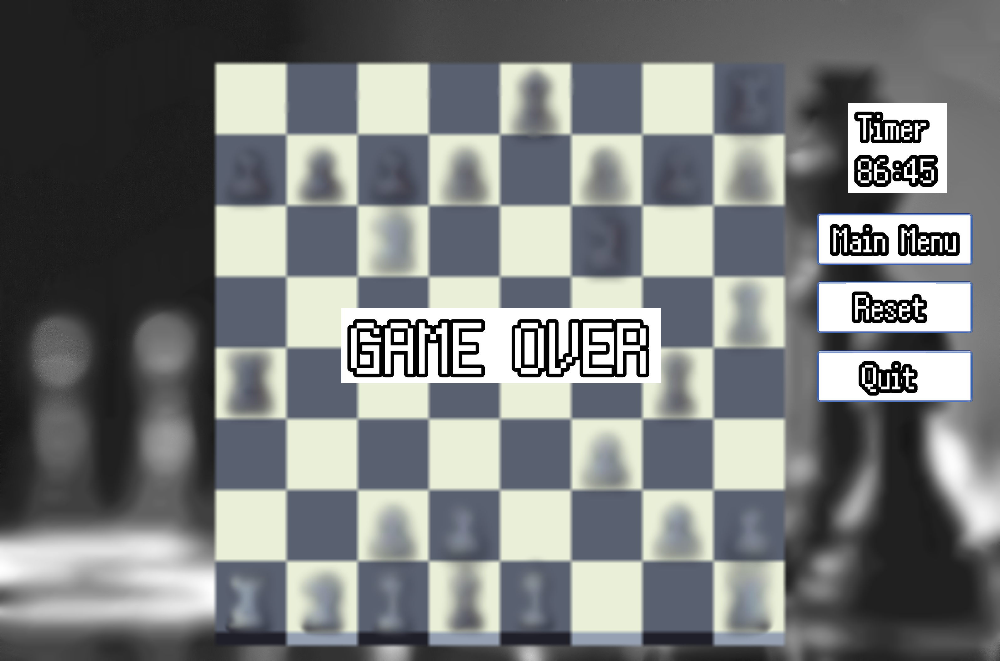
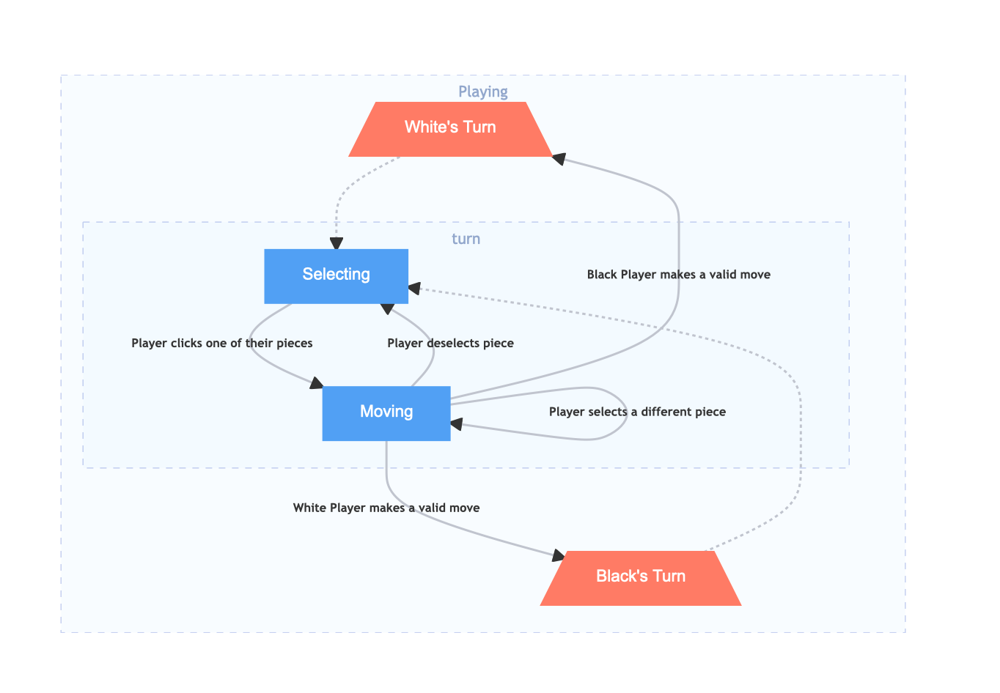

## Software Design Document
---
# Chessboard

## Contributors:
**Team Prometheus**

- Brad 
- Josh
- Ricardo
- Rishabh

## Contents
1. Introduction
1.1.	Purpose
1.2.	scope
2.	Design Overview
2.1.	Description of the program
2.2.	Technologies Used
2.3.	Diagram
3.	States
3.1.	State Diagram
4.	UI (pictures & description)
4.1.	Main Menu
4.2.	In Game
4.3.	Help
4.4.	Credits
4.5.	End Game
5.	Controls
5.1.	Selecting a piece
5.2.	Moving a piece
6.	[Chessboard (Model)](#chessboard-model)
    1.	Attributes
        1. Public
        2. Private
    2.	Methods
        1. Public
        2. Private
7.	Controller
8.	View
9.	Piece
9.1.	Attributes
9.2.	Struct Position
9.3.	Methods

## 1. Introduction
### 1.1 Purpose
The purpose of this document is to provide a detailed description of the implementation of the chess software built by the team Prometheus. Software is a c++ based chess game.
### 1.2 Scope
The document describes the implementation details of the chess program. The program consists of 3 major constituents, namely Model, Controller, View (Names are subject to change). The document will not be concerned with any testing of the program.
## 2. Design Overview
### 2.1 Description of the Program
Chessboard is a two-player pass-and-play chess game. The game will take place on a traditional 64-tile chessboard in a graphical environment. Upon launching Chessboard, the user can start a game via the main menu. On their turn, a player can select one of their chess pieces and move it to any legal tile. When a player selects a piece, the piece will follow the mouse until the player selects a valid tile to place it, after which the next player will take their turn using the same keyboard and mouse. The game will follow all rules outlined in http://www.fraserheightschess.com/Documents/BasicChessRules.pdf.
### 2.2 Technologies Used
The chess program is entirely based on C++. The program uses SDL libraries for the graphical components. OpenGL libraries maybe used.

The target platforms are Microsoft Windows, Linux and MacOS.
### 2.3 Diagram

## 3. States
### 3.1 State Diagram
The game will have several screens with which the user can interact. The above diagram demonstrates how the user can move between the different screens. Below, each screen is described in detail and accompanied by a mock-up.
## 4. UI (Pictures & Descriptions)
### 4.1 Main Menu
<div style="text-align: center">                                                
                   
</div>                   
The Main Menu is the Startup screen of the application. From here, users can navigate to all sections of the application. The Main Menu gives the user the following options:

- Start – Start a pass-and-play game of chess with another player.
- Help – Read the instruction for the app.
- Credits – Credits screen credits all the developers with a short description of their role. Exit – Stops the program.

The Main Menu is also accessible after a game ends and from the in-game state if any player chooses to do so.

### 4.2 In Game
<div style="text-align: center">                                                
                   
</div>                   
The chess game starts with the white’s turn and alternates legal moves between black and white until one of the kings is checkmated. Players can navigate the application’s different states, even in the in-game state. The applications allow users to quit the program or go to the main menu. Users also have the option to reset the game if they wish to start a new game from this state itself.

### 4.3 Help
<div style="text-align: center">                                                
                   
</div>                   
The Help screen is accessible from the main menu. This page contains basic instructions on how to use the app. Instructions like what type of input the app expects, what’s considered a bad input, and what other bounds there are on the user.
It also presents a brief overview of some basic chess rules and piece movements, acting as an introduction for new players to chess.

### 4.4. Credits
<div style="text-align: center">                                                
                   
</div>                   
The “credits” page’s objective is to recognize the individuals involved in producing the product. The page’s style is straightforward: identify everyone engaged in the program’s creation and provide a summary of their role or contribution.
Any outside help and references are also listed here.

### 4.5. End Game
<div style="text-align: center">                                                
                   
</div>                   
The end game screen appears when one of the players has won the game by either checkmating the opponent or one of the players resigns. This state is a dialogue box that lets users choose from the following options

- Main menu – This option takes the user back to the main menu state.
- Reset – This option restarts the game and takes the users directly to the in-game state.
- Quit – This option stops and ends the program.


## 5. Controls
<div style="text-align: center">                                                
                   
</div>                   
### 5.1. Selecting a piece
At the start of the player’s turn, they can select any of their pieces by left clicking on it and then releasing the mouse button. Once selected, the piece will follow the player’s cursor around the screen. Nothing will happen if a player tries to select one of their opponent’s pieces.

**Deselecting a Piece**
The player can return a selected piece to its original position by left-clicking the tile from which the piece came. Doing so will result in no pieces following the cursor.

**Selecting a different piece**
If the player decides they want to move a different piece instead, they can select a new piece by left clicking on it. The initially selected piece will return to its original position after the mouse button is released.

### 5.2. Moving a piece
Once the player has selected a piece, they can choose a new position for it by left clicking one of the highlighted tiles. Once the mouse button is released, the piece will instantly move on to the clicked tile and no longer follow the cursor. Nothing will happen if the player clicks an invalid tile, and the selected piece will continue to follow the cursor.

**If the player moves the mouse out of the window**
The selected piece will remain in the position the player moved the cursor out of the window. However, once the player moves the cursor back inside the window, the piece will immediately jump to the cursor’s position.

## 6. Chessboard (Model) 
```
is _game _over
curr_player
selected
board

move(source, destination)
select(piece)
deselect_piece()
reset_ board()
get board()
take(piece)
is valid move(source, destination)
get_moves(piece)
```
Chessboard directly manages the internal representation of the game board's state, and contains all its related logic. It is completely independent from the user interface and can exist on its own.
### 6.1. Attributes
#### 6.1.1 Public
- **is_game_over :** boolean
    - A flag denoting whether or not the game has reached a terminal state either by checkmate, or resignation   
<br>

- **curr_player :** boolean
    - A boolean value indicating which player is currently taking their turn. True if it is the white players turn, and false if it is the black players turn.
<br>

- **selected :** Piece
    - stores the currently selected `Piece` if there is one, otherwise `Null` if no piece is selected.
#### 6.1.2 Private
- **board :** Array\<Array\<Piece\>\> 
    - a 2-dimensional array containing pointers to `Piece` objects. If the pointer in a given cell is `Null` it indicates that the tile is empty.
<br> 

### 6.2. Methods

#### 6.2.1 Public
- **move(source:** Position, **destination:** Position **) :** boolean
    - In the `board` array, if a piece exists in the source position and destination is a valid move for that piece, move the piece from source to destination on the board and return true, otherwise return false.
<br>

- **select( piece:** Position **) :** boolean
    - If there is a piece at the provided position on the board, update the object's `selected` property to said piece and return true, otherwise return false.
<br>

- **deselect( ) :** boolean
    - If there is currently a piece selected, set the `selected` property to `Null` and return true. If no piece is selected return false.
<br>

- **reset_board( ) :** void
    - re-initialize Chessboard's `board` array, putting all pieces back to the default positions
<br>

- **get_board( ) :** Array\<Array\<PieceNum\>\>
    - returns a simplified representation of the `board` array. This simplified 2-dimensional array will contain the `PieceNum` counterpart for each element in the original `board` array.
<br>

#### 6.2.2 Private
- **take( piece:** Position **) :** boolean
    - removes the piece at the provide position from the game and then return true. If the provided position is empty, return false.
<br>

- **is_valid_move( source:** Position, **destination:** Position **) :** boolean
    - checks if available moves for the piece at the source position contains the destination position. If so, return true, otherwise false.
<br>

- **get_moves( piece:** Position **) :** Array\<Position\>
    - get the moves for the piece at the provided position on the `board`. If a piece exists at the provided position, call its `available_moves()` method and return the resulting array. If no piece exists at the provided position, return an empty array.

## 7. ChessController
```
Chessboard
process_click(position)
get_selected_pieced( )
get_board_state( )
reset( )
current player( )
```
Exposing only necessary aspects of `Chessboard`, The chess controller acts as an intermediary between the user interface and the game's internal representation and logic. It provides `SDLChessGame` with enough information about the state of the `game`'s board to draw it to the screen. The only input `SDLChessGame` needs to provide the chess controller is the `Position` on the `game` board a player has clicked. Using the internal state of the `game`, it determines the users intent.
### 7.1 Attributes
#### 7.1.1 Private
- **game :** Chessboard
    - The internal representation of the gameboard.
### 7.2 Methods
#### 7.2.1 Public
```
if a piece is selected:
    move it to the clicked position
else if the clicked position is the tile of the selected piece:
    deselect the currently selected piece
otherwise, if the clicked tile contains a piece
    select the clicked piece
```
- **process_click(position:** Position **)**
    - If the player doesn't currently have a piece selected, select the piece in the provided `position` if one exists, otherwise, attempt to move the currently selected piece to the clicked `position`.
<br>

- **get_selected_pieced( ) :** PieceNum
    - return the `PieceNum` associated with the currently selected `Piece`. If no piece is selected, return `Null`.
<br>

- **get_board_state( ) :** Array\<Array\<PieceNum\>\>
    - return the current layout of pieces on the gameboard. `PieceNum` is used to limit direct access to the games'`Piece` objects.
<br>

- **reset( )**
    - return the gameboard to its initial state, putting all the pieces back to their default tiles by utilizing `game`'s `reset_board()` method.
<br>

- **current_player( ) :** boolean
    - return `game`'s current player


## 8. SDLChessGame
```
assets
controller 
curr_ state
dirty

change_state(state)
run_loop()
```
The central component of the user interface, `SDLChessGame` manages the UI's current state. It is in charge of switching between menus and running the game loop. It also acts as a container for all of the game's assets.`SDLChessGame` is also in charge of passing information to the `ChessController` when necessary so it can update the games internal representation.
### 8.1 Attributes
#### 8.2.1 Public
- **assets :** Dictionary
    - Contains all images used in the game. The images associated with a specific `Piece` can be accessed using its related `PieceNum` as a key.
<br>
- **dirty :** boolean
    - a flag denoting whether or not an event has occured that requires the screen to be redrawn. This prevents the program from having to redraw the entire screen on each iteration of the game loop.
<br>
- **controller :** ChessController
    - The controller acts as a proxy between the games model, `ChessBoard`, and `SDLChessGame`, providing it with method for seeing and interacting with the games internal state, without being able to directly modify it.
<br>
#### 8.1.1 Private
- **curr_state :** State
    - the screen the player is currently interacting with. This property provides `SDLChessGame` with methods for processing events and displaying the current screen to the user.
<br>
### 8.2 Methods
#### 8.2.1 Public
- **change_state(state:** State **)**
    - This is used to transition the program from one screen to another. It deletes the current state and replaces it with the provided one. `SDLChessGame` will use this newly created states methods inside of `run_loop`.
<br>

```
while the game is not over:
    process events
    update internal representation
    render the screen
```
- **run_loop()**
    - continuously processes events from the user, updates the progams internal state then renders the screen with respect to the current state of the user interface.

## 9. Piece
Piece is an abstract base class which will be implemented by the following classes:

- Pawn
- Rook
- Knight
- Bishop
- Queen
- King

### 9.1. Attributes
#### 9.1.1 Public 
- position: Position
    - the location on the `board` at which the piece is located.
<br>

#### 9.1.2 Private
- colour: bool
<br>

- board: Chessboard
### 9.2. Methods
### 9.2.1 Public
- get_colour() : bool

### 10 Globals
#### 10.1 Position
#### 10.2 PieceNum
#### 10.3 Constants
- WHITE : true
    - a constant boolean representing the white player
- BLACK : false
    - a constant boolean representing the black player
