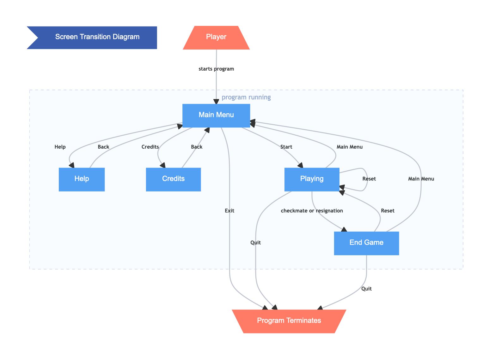

# Chessboard

## Table of Contents
1. [Overview](#overview)
2. [Platforms](#platforms)
3. [Scenarios](#scenarios)
4. [Screens](#screens)
   1. [Main Menu](#main-menu)
   2. [Help](#help)
   - [Credits](#credits)
   - [In Game](#in-game)
   - [End Game](#end-game)
5. [Controls](#controls)
   - [Selecting a Piece](#selecting-a-piece)
      - [Deselecting a Piece](#deselecting-a-piece)
      - [Selecting a Different Piece](#selecting-a-different-piece)
   - [Moving a Piece](#moving-a-piece)
      - [If the Player Moves the Mouse Out of the Window](#mouse-off-screen)

## Overview <a name="overview" />
Chessboard is a two-player pass-and-play chess game. The game will take place on a traditional 64-tile chessboard in a graphical environment. Upon launching Chessboard, the user can start a game via the main menu. On their turn, a player can select one of their chess pieces and move it to any legal tile. When a player selects a piece, the piece will follow the mouse until the player selects a valid tile to place it, after which the next player will take their turn using the same keyboard and mouse. The game will follow all rules outlined in http://www.fraserheightschess.com/Documents/BasicChessRules.pdf.

## Platforms <a name="platforms" />
Linux, macOS, Windows

## Scenarios <a name="scenarios" />
Two users can sit down together with a laptop. No matter where they are, they will be able to open the chess game and can sit together at the same computer. They can start a game together, pass the laptop between one another, and play a full, complete game of chess together without having a physical chess board, which requires time to set up.

## Screens <a name="screens" />

The game will have several screens with which the user can interact. The above diagram demonstrates how the user can move between the different screens. Below, each screen is described in detail and accompanied by a mockup.

### Main Menu <a name="main-menu" />

The Main Menu is the Startup screen of the application. From here, users can navigate to all sections of the application. The Main Menu gives the user the following options:

- **Start** – Start a pass-and-play game of chess with another player.
- **Help** – Read the instruction for the app.
- **Credits** – Credits screen credits all the developers with a short description of their role.
- **Exit** – Stops the program.

The Main Menu is also accessible after a game ends and from the in-game state if any player chooses to do so.
### In Game <a name="in-game" />

The chess game starts with the white's turn and alternates legal moves between black and white until one of the kings is checkmated. Players can navigate the application's different states, even in the in-game state. The applications allow users to quit the program or go to the main menu. Users also have the option to reset the game if they wish to start a new game from this state itself.

### Help <a name="help" />

The Help screen is accessible from the main menu. This page contains basic instructions on how to use the app. Instructions like what type of input the app expects, what's considered a bad input, and what other bounds there are on the user.
It also presents a brief overview of some basic chess rules and piece movements, acting as an introduction for new players to chess.

### Credits <a name="credits" />

The "credits" page's objective is to recognize the individuals involved in producing the product. The page's style is straightforward: identify everyone engaged in the program's creation and provide a summary of their role or contribution.
Any outside help and references are also listed here.

### End Game <a name="end-game" />

The end game screen appears when one of the players has won the game by either checkmating the opponent or one of the players resigns. This state is a dialogue box that lets users choose from the following options:

-	**Main Menu** – This option takes the user back to the main menu state.
-  **Reset** – This option restarts the game and takes the users directly to the in-game state.
-	**Quit** – This option stops and ends the program.

## Controls <a name="controls" /> 
There will be two distinct phases on a given player's turn: selecting a piece and then choosing a position to move it.

### Selecting a piece <a name="selecting-a-piece" />
At the start of the player's turn, they can select any of their pieces by left-clicking on it and then releasing the mouse button. Once selected, the piece will follow the player's cursor around the screen. Nothing will happen if a player tries to select one of their opponent's pieces.

#### Deselecting a Piece <a name="deselecting-a-piece" />
The player can return a selected piece to its original position by left-clicking the tile from which the piece came. Doing so will result in no pieces following the cursor.

#### Selecting a different piece <a name="selecting-a-different-piece" />
If the player decides they want to move a different piece instead, they can select a new piece by left-clicking on it. The initially selected piece will return to its original position after the mouse button is released.

### Moving a piece <a name="moving-a-piece" />
Once the player has selected a piece, they can choose a new position for it by left-clicking one of the highlighted tiles. Once the mouse button is released, the piece will instantly move on to the clicked tile and no longer follow the cursor. Nothing will happen if the player clicks an invalid tile, and the selected piece will continue to follow the cursor.

#### If the player moves the mouse out of the window <a name="mouse-off-screen" />
The selected piece will remain in the position the player moved the cursor out of the window. However, once the player moves the cursor back inside the window, the piece will immediately jump to the cursor's position.
